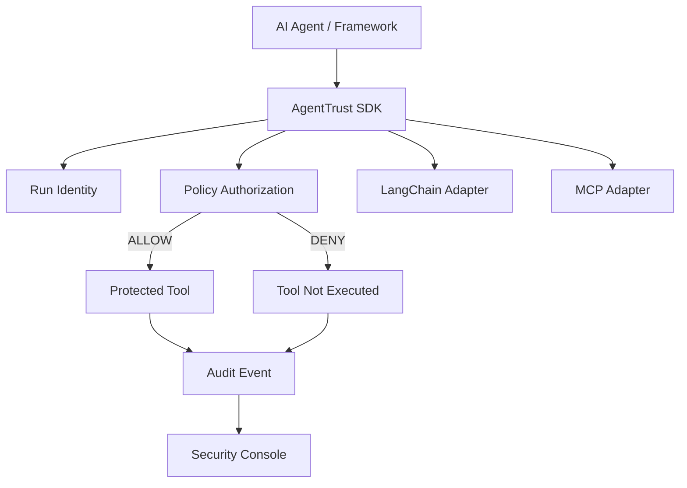

# AgentTrust

[](https://github.com/ravionxgroup/agenttrust/actions/workflows/ci.yml)

Least-privilege identity, scoped authorization, and audit visibility for AI agent tool calls.

AgentTrust is an SDK-first security layer for cooperative first-party agent code. Each agent run receives a short-lived, scoped identity. Every guarded tool call is authorized before execution, denied by default when scope is missing, and recorded to a local JSONL audit trail. The Security Console provides read-only visibility into that audit and policy data.

> **Current boundary.** AgentTrust currently enforces in-process through the Python SDK. It is useful for least-privilege discipline, auditability, and integration evidence, but it is not a hard security gateway. Non-cooperative or adversarial code running outside the SDK can bypass these guards.

## Why AgentTrust

Agent frameworks make it easy to give autonomous workflows broad, long-lived tool access. AgentTrust narrows that surface:

- short-lived per-run agent identity instead of broad ambient authority
- scoped authorization for each protected tool call
- deny-by-default policy behavior for unknown agents and missing scopes
- authorization before tool execution
- audit events for allowed calls, denied calls, and execution errors
- MCP and LangChain integrations without coupling them to the core SDK
- a read-only Security Console for local visibility

## How It Works

Conceptual flow:

```text
AI Agent / Framework
  -> AgentTrust SDK
  -> Run Identity
  -> Policy Authorization
  -> Protected Tool
  -> Audit Event
  -> Security Console
```

Security behavior:

```text
Agent requests tool
  -> required scope evaluated
  -> ALLOW
  -> execute tool
  -> audit result
```

```text
Agent requests tool
  -> required scope evaluated
  -> DENY
  -> tool is NOT executed
  -> audit denial
```

## Core Capabilities

- **Per-run identity:** `start_run()` issues a short-lived JWT identity with `agent_id`, `run_id`, scopes, issuer, timestamps, and `token_id`.
- **Scoped authorization:** each guarded call declares the required scope for that tool operation.
- **Deny by default:** unknown agents and out-of-scope calls fail closed.
- **Authorize before execution:** denied calls do not invoke the wrapped tool.
- **Audit trail:** each call attempt writes an audit event with decision, reason, redacted arguments, and execution result when applicable.
- **MCP integration:** MCP client/session wrappers authorize MCP tool calls with explicit or metadata-provided scopes.
- **LangChain integration:** helpers expose guarded callables as LangChain tools.
- **Security Console:** a self-contained Next.js console renders read-only audit and policy visibility.

## Architecture



Core modules:

- `agenttrust/identity.py`: token issuance and verification
- `agenttrust/policy.py`: declarative deny-by-default scope policy
- `agenttrust/audit.py`: JSONL audit events and argument redaction
- `agenttrust/langchain.py`: LangChain adapter
- `agenttrust/mcp.py`: MCP client/session adapter
- `console/`: read-only Security Console

## Security Console

The AgentTrust Security Console is a local, read-only Next.js application in [console/](console/). It provides visibility into:

- Overview
- Agents
- Runs
- Audit Explorer
- Tools
- Declared Policies

The Console separates data sources deliberately:

- **Observed data:** Agents, Runs, Audit, and Tools are reconstructed from audit events.
- **Declared data:** Policies are loaded from AgentTrust policy YAML or demo policy fixtures.

The Console does not participate in authorization, does not edit policy, and does not expand the SDK's enforcement boundary. Enforcement remains in the in-process AgentTrust SDK.

### Screenshots

No screenshot files are currently present in the repository, so this README intentionally does not include image links yet.

Recommended screenshot location:

```text
docs/assets/screenshots/
```

Recommended files to add:

1. `console-run-detail-denied-not-executed.png`: Run Detail showing `restart_service` / `service.restart` denied with `scope not granted` and `NOT EXECUTED`.
2. `console-overview.png`: Overview showing metrics, recent authorization activity, denied tools, authorization summary, and data source indicator.
3. `console-audit-explorer.png`: optional Audit Explorer screenshot if a third image helps reviewers understand event inspection.

## Quick Start

### Python SDK

Install from source:

```bash
git clone https://github.com/ravionxgroup/agenttrust.git
cd agenttrust
python3 -m pip install --upgrade pip
python3 -m pip install -e .
```

Install development dependencies:

```bash
python3 -m pip install -e ".[dev]"
```

Optional extras:

```bash
python3 -m pip install -e ".[yaml]"
python3 -m pip install -e ".[langchain]"
python3 -m pip install -e ".[mcp]"
python3 -m pip install -e ".[all]"
```

Run tests:

```bash
python3 -m pytest
```

Run examples:

```bash
python3 examples/demo.py
python3 examples/mcp_demo.py
python3 examples/mcp_authorization_evidence.py
python3 examples/langchain_demo.py
```

### Basic SDK Usage

```python
from agenttrust import AgentTrust, ToolDenied
from agenttrust.policy import Policy

at = AgentTrust(
    policy=Policy.from_yaml("policy.example.yaml"),
    secret="your-32-char-secret-key-here!!!",
)

with at.start_run("support-agent") as run:
    result = run.call("crm.read", get_customer, customer_id=42)

    try:
        run.call("payment.refund", do_refund, amount=500)
    except ToolDenied:
        pass
```

### Security Console

Install and run the Console:

```bash
cd console
npm install
npm run dev
```

By default, the Console uses demo audit and policy fixtures.

Use a local audit file:

```bash
AGENTTRUST_AUDIT_PATH=../agenttrust_audit.jsonl npm run dev
```

Use a local policy file:

```bash
AGENTTRUST_POLICY_PATH=../policy.example.yaml npm run dev
```

Use both:

```bash
AGENTTRUST_AUDIT_PATH=../agenttrust_audit.jsonl \
AGENTTRUST_POLICY_PATH=../policy.example.yaml \
npm run dev
```

Build the Console:

```bash
npm run build
```

## Audit Events

Every guarded tool call attempt writes one JSON line to `agenttrust_audit.jsonl` by default:

```json
{"event_id":"evt_...","ts":1234567890.1,"agent_id":"support-agent","run_id":"run_abc","token_id":"tok_xyz","tool":"get_customer","required_scope":"crm.read","decision":"allow","reason":null,"args_redacted":{"customer_id":42},"result_status":"ok"}
{"event_id":"evt_...","ts":1234567890.2,"agent_id":"support-agent","run_id":"run_abc","token_id":"tok_xyz","tool":"do_refund","required_scope":"payment.refund","decision":"deny","reason":"scope not granted","args_redacted":{"amount":500},"result_status":null}
```

Sensitive argument keys such as `password`, `token`, `api_key`, `access_token`, and `client_secret` are redacted before logging. Redaction is key-based and may not remove all sensitive operational context.

View the audit log:

```bash
agenttrust audit
agenttrust audit --last 20
agenttrust audit --decision deny
agenttrust audit --agent support-agent
agenttrust audit --raw
```

## Integrations

LangChain:

```python
from agenttrust.langchain import as_langchain_tools

with at.start_run("support-agent") as run:
    tools = as_langchain_tools(run, [
        ("crm.read", get_customer),
        ("ticket.create", create_ticket),
    ])
```

MCP:

```python
from agenttrust.mcp import wrap_mcp_client

with at.start_run("support-agent") as run:
    mcp = wrap_mcp_client(
        run,
        session,
        tool_scopes={"get_customer": "crm.read"},
    )
    result = await mcp.call_tool("get_customer", {"customer_id": 42})
```

MCP tools can also declare required scopes in metadata:

```python
@server.tool(meta={"agenttrust/scope": "crm.read"})
def get_customer(customer_id: int) -> dict:
    ...
```

## Boundaries And Limitations

- Current enforcement is in-process SDK enforcement.
- The Console is read-only and has no authentication or RBAC.
- Local JSONL audit is append-only-style by convention, not immutable or tamper-proof storage.
- AgentTrust does not currently provide a hard security gateway, managed control plane, centralized policy service, distributed enforcement system, production SaaS, or security findings/risk engine.
- Tokens currently use HS256 shared-secret signing. Asymmetric signing and key rotation are future work.
- Run timing in the Console uses first and last observed audit events, not explicit run lifecycle records.

## Repository Navigation

| Path | Purpose |
|---|---|
| [agenttrust/](agenttrust/) | Python SDK package |
| [examples/](examples/) | Runnable SDK, MCP, and LangChain examples |
| [tests/](tests/) | Unit and adapter tests |
| [console/](console/) | Read-only AgentTrust Security Console |
| [policy.example.yaml](policy.example.yaml) | Example deny-by-default policy |
| [docs/onboarding.md](docs/onboarding.md) | Evaluation and integration walkthrough |
| [docs/threat-model.md](docs/threat-model.md) | Trust boundary and threat model |
| [docs/evidence/README.md](docs/evidence/README.md) | Verified runtime evidence index |
| [docs/feedback.md](docs/feedback.md) | Structured evaluator feedback prompts |
| [SECURITY.md](SECURITY.md) | Security policy |

## Roadmap

Future work remains intentionally outside this SDK-first milestone:

- gateway or sidecar enforcement
- asymmetric signing and key rotation
- centralized audit storage and SIEM export
- managed policy/control plane

## License And Security

Licensed under the MIT License. See [LICENSE](LICENSE).

For vulnerability reporting, see [SECURITY.md](SECURITY.md).
