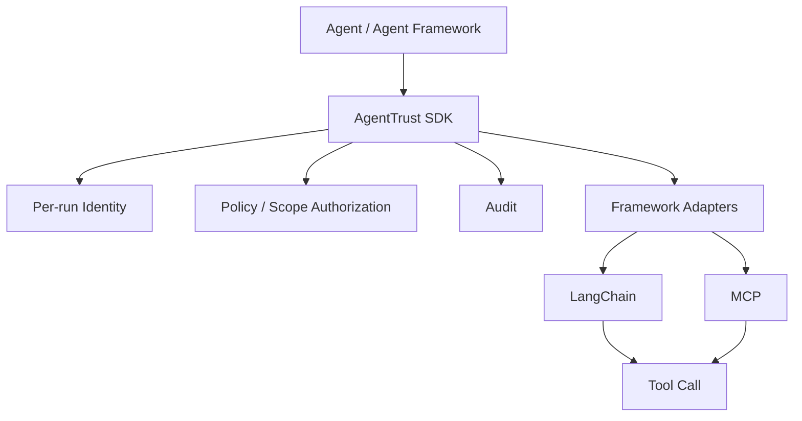

# AgentTrust

[](https://github.com/ravionxgroup/agenttrust/actions/workflows/ci.yml)

Least-privilege identity + audit for AI agents.

Every agent run gets a short-lived, scoped JWT identity. Every tool call is authorized against that identity and written to a local audit log before the tool executes. Unknown agents and out-of-scope calls are denied by default.

> **MVP scope.** AgentTrust is currently an SDK-first milestone: soft in-process enforcement plus local audit for cooperative first-party code. Non-cooperative or adversarial code can bypass in-process guards. Hard enforcement requires the future gateway and managed control plane. Treat the SDK as a visibility and least-privilege layer today, not as a hard security boundary.

## Why AgentTrust

Agent frameworks make it easy to wire broad tool access into autonomous workflows. AgentTrust keeps the first milestone intentionally narrow:

- per-run identity instead of long-lived agent-level authority
- short-lived HS256 JWTs with scoped claims
- deny-by-default policy evaluation
- audit-before-execution for both allow and deny decisions
- thin LangChain and MCP adapters isolated from the core identity, policy, and audit modules

## Install

The public PyPI name `agenttrust` is not currently evidenced as this RavionX repository's distribution. Install this project from source:

```bash
git clone https://github.com/ravionxgroup/agenttrust.git
cd agenttrust
python -m pip install --upgrade pip
python -m pip install -e .
```

Optional extras:

```bash
python -m pip install -e ".[yaml]"      # Policy.from_yaml()
python -m pip install -e ".[langchain]" # LangChain adapter
python -m pip install -e ".[mcp]"       # MCP adapter (Python >= 3.10)
python -m pip install -e ".[all]"       # YAML + LangChain
```

For local development and tests:

```bash
python -m pip install -e ".[dev]"
```

## Quickstart

### 1. Define a policy

```yaml
# policy.yaml
issuer: my-org
default_ttl_seconds: 300
agents:
  support-agent:
    scopes: ["crm.read", "kb.search", "ticket.*"]
  billing-agent:
    scopes: ["invoice.read", "payment.read"]
```

### 2. Wrap tool calls

```python
from agenttrust import AgentTrust, ToolDenied
from agenttrust.policy import Policy

at = AgentTrust(
    policy=Policy.from_yaml("policy.yaml"),
    secret="your-32-char-secret-key-here!!!",
)

with at.start_run("support-agent") as run:
    result = run.call("crm.read", get_customer, customer_id=42)  # allowed + audited

    try:
        run.call("payment.refund", do_refund, amount=500)        # denied + audited
    except ToolDenied:
        pass
```

## Usage Patterns

Direct calls:

```python
with at.start_run("support-agent") as run:
    result = run.call("crm.read", get_customer, customer_id=42)
```

Decorator:

```python
run = at.start_run("support-agent")

@run.guarded("crm.read")
def get_customer(customer_id: int) -> dict:
    ...

result = get_customer(customer_id=42)
```

LangChain:

```python
from agenttrust.langchain import as_langchain_tools

with at.start_run("support-agent") as run:
    tools = as_langchain_tools(run, [
        ("crm.read", get_customer),
        ("ticket.create", create_ticket),
    ])
```

MCP:

```python
from agenttrust.mcp import wrap_mcp_client

with at.start_run("support-agent") as run:
    mcp = wrap_mcp_client(
        run,
        session,
        tool_scopes={"get_customer": "crm.read"},
    )
    result = await mcp.call_tool("get_customer", {"customer_id": 42})
```

MCP tools can also declare required scopes in metadata:

```python
@server.tool(meta={"agenttrust/scope": "crm.read"})
def get_customer(customer_id: int) -> dict: ...
```

## Architecture



Execution flow:

```text
start_run(agent)
      |
      v
short-lived scoped JWT
      |
      v
tool invocation requested
      |
      v
authorize required scope
      |
   allow / deny
      |
      v
audit decision
      |
      v
execute tool only if allowed
```

Core modules stay independent of framework adapters:

- `agenttrust/identity.py`: token issuance and verification
- `agenttrust/policy.py`: declarative deny-by-default scope policy
- `agenttrust/audit.py`: JSONL audit events and argument redaction
- `agenttrust/langchain.py`: LangChain adapter
- `agenttrust/mcp.py`: MCP client/session adapter

## Audit

Every tool call attempt writes one JSON line to `agenttrust_audit.jsonl` by default:

```json
{"event_id":"evt_...","ts":1234567890.1,"agent_id":"support-agent","run_id":"run_abc","token_id":"tok_xyz","tool":"get_customer","required_scope":"crm.read","decision":"allow","reason":null,"args_redacted":{"customer_id":42},"result_status":"ok"}
{"event_id":"evt_...","ts":1234567890.2,"agent_id":"support-agent","run_id":"run_abc","token_id":"tok_xyz","tool":"do_refund","required_scope":"payment.refund","decision":"deny","reason":"scope not granted","args_redacted":{"amount":500},"result_status":null}
```

Sensitive argument keys such as `password`, `token`, `api_key`, `access_token`, and `client_secret` are redacted before logging.

View the audit log:

```bash
agenttrust audit
agenttrust audit --last 20
agenttrust audit --decision deny
agenttrust audit --agent support-agent
agenttrust audit --raw
```

## Security Properties And Limitations

- **Soft enforcement today.** The SDK guards cooperative first-party code in-process. Non-cooperative or adversarial code can bypass the SDK.
- **Future hard boundary.** Hard enforcement requires the planned gateway so tool traffic can be mediated outside agent code.
- **Deny-by-default.** Unknown agents have no scopes. Bad tokens fail closed. Missing MCP scope mappings can be configured to fail closed.
- **MVP signing.** Tokens use HS256 with a shared secret. Asymmetric RS256/EdDSA signing is future work.
- **Local audit.** JSONL audit is append-only by convention, not tamper-proof storage.
- **Redaction floor.** Redaction is key-name based and truncates long strings; it is not comprehensive PII detection.

See [Threat Model & Trust Boundary](docs/threat-model.md) for the detailed SDK-level security boundary.

## Development And Validation

Install development dependencies:

```bash
python -m pip install -e ".[dev]"
```

Run tests:

```bash
python -m pytest
```

Run example smoke tests:

```bash
python examples/demo.py
python examples/mcp_demo.py
python examples/mcp_authorization_evidence.py
```

The test suite validates token issuance and verification, expiry handling, fail-closed policy behavior, scope enforcement, wildcard scopes, audit allow/deny/error behavior, argument redaction, MCP adapter behavior, LangChain adapter behavior when `langchain-core` is installed, async paths, malformed policy handling, and concurrent audit writes/runs.

No lint or typecheck command is currently configured in `pyproject.toml`.

## Repository Structure

| Path | Purpose |
|---|---|
| `agenttrust/` | Python SDK package |
| `tests/` | Unit and adapter tests |
| `examples/` | Concise runnable examples |
| `docs/onboarding.md` | Evaluation and integration walkthrough |
| `docs/feedback.md` | Structured evaluator feedback prompts |
| `docs/archive/` | Historical build-plan material |
| `policy.example.yaml` | Example deny-by-default policy |

## Roadmap

Future work remains intentionally out of this SDK-first milestone:

- gateway or sidecar enforcement
- asymmetric signing and key rotation
- centralized audit storage and SIEM export
- managed policy/control plane
- SSO, PKI, dashboards, and anomaly detection

## Maintainer

AgentTrust is a RavionX open-source engineering project maintained by Ravinder Varkali.

GitHub: https://github.com/rvarkali

## License And Security

Licensed under the MIT License. See [LICENSE](LICENSE).

For vulnerability reporting, see [SECURITY.md](SECURITY.md).
