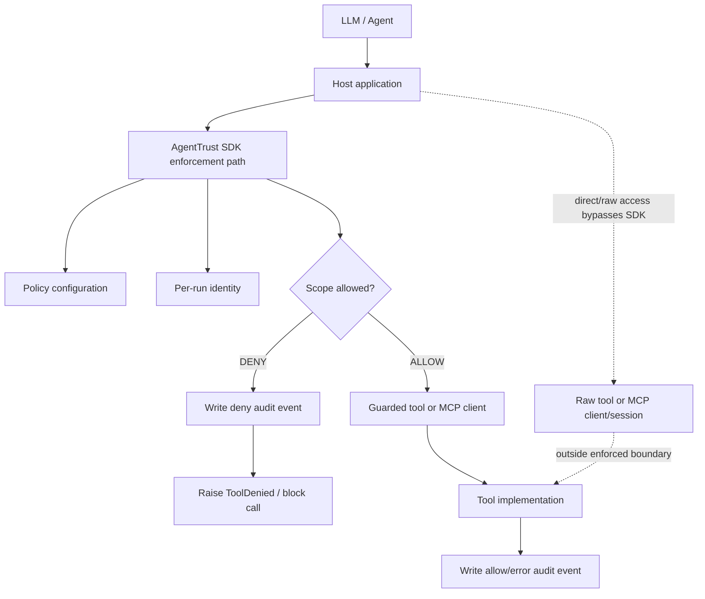

# Threat Model & Trust Boundary

AgentTrust is an SDK-level authorization layer for cooperative agent and tool
code. It provides meaningful least-privilege enforcement for calls routed
through the AgentTrust execution path, but it is not process isolation and it
does not prevent bypass by code that directly holds the underlying tool,
client, shell, database, or MCP session.

This document describes the current SDK-first implementation. Future gateway,
control-plane, and durable-audit ideas are intentionally treated as future
hardening, not current security properties.

## System And Trust Model

Actors in the current implementation:

- Agent / LLM-driven application: selects or requests tool actions.
- Host application: owns process execution and decides whether to route calls
  through AgentTrust.
- AgentTrust SDK: issues per-run identity, checks scopes, invokes tools through
  guarded paths, and writes audit events.
- Policy configuration: maps known agent IDs to allowed scope patterns and
  optional per-agent token lifetimes.
- Per-run identity: decoded JWT-backed identity containing agent ID, run ID,
  scopes, issuer, issued-at time, expiry, and token ID.
- Tool adapter: `AgentRun.call`, `AgentRun.acall`, `AgentRun.guarded`, or a
  supported framework adapter.
- MCP guarded client: `GuardedMCPClient`, which maps MCP tool names to
  AgentTrust scopes before invoking the underlying MCP client.
- Raw MCP client/session: the original MCP client object. Direct access to it is
  outside AgentTrust enforcement.
- Tool implementation: application code that performs the requested work.
- Audit sink: local JSONL file written by `AuditSink`.



The enforced boundary is the SDK call path. It does not isolate the Python
process or mediate code that bypasses the wrapper.

## Security Objectives

Current objectives implemented by the SDK:

- Per-run identity: each run receives a distinct run ID and token ID.
- Short-lived credentials: the default lifetime is 300 seconds, with optional
  per-agent overrides.
- Least-privilege scopes: policy grants are per agent and scope matching uses
  glob patterns such as `ticket.*`.
- Authorization before tool execution: guarded calls check scope before calling
  the underlying function or MCP client.
- Fail-closed behavior: unknown agents, expired identities, missing required
  scopes, and malformed required-scope inputs do not execute tools through the
  guarded path.
- Allow and deny audit records: guarded call attempts produce JSONL audit
  events with agent, run, tool, scope, decision, reason, redacted arguments, and
  result status where applicable.
- Controlled adapters: direct SDK calls, decorators, LangChain wrappers, and MCP
  guarded-client calls route through the same `AgentRun` authorization path.

MCP scope mapping is explicit when `tool_scopes`, tool metadata, or a custom
resolver is used. If `default_to_tool_name=True`, an unmapped MCP tool name is
treated as the required scope. If `default_to_tool_name=False`, an unmapped tool
fails closed with `MCPToolScopeError` and a deny audit event.

## Assets To Protect

- Tool capabilities exposed to an agent.
- Privileged application actions behind those tools.
- Agent identity and run identity.
- Policy grants and scope names.
- JWT signing secret.
- Tool arguments, especially credentials and sensitive user data.
- Audit records used for investigation and accountability.

AgentTrust protects these assets only for execution routed through the SDK
boundary. It does not protect resources accessed directly outside that path.

## Threat Matrix

| Threat | Attack | Current mitigation | Residual risk | Status |
| --- | --- | --- | --- | --- |
| Prompt-injected agent selects unauthorized tool | LLM attempts a tool/action outside the agent policy | Guarded calls authorize the required scope before execution and raise `ToolDenied` on deny | Only applies if the host routes the tool call through AgentTrust | MITIGATED |
| Unauthorized scope | Caller asks for `payment.refund` while holding only `crm.read` / `ticket.*` | Scope check uses the per-run identity scopes and denies missing scopes | Broad wildcard grants can still allow too much | MITIGATED |
| Unknown agent | Host starts a run for an agent missing from policy | `Policy.for_agent` raises `PolicyError` instead of issuing broad authority | The host must treat startup failure as fatal for that run | MITIGATED |
| Unknown MCP tool | MCP tool has no configured or discovered scope mapping | With `default_to_tool_name=False`, the wrapper raises `MCPToolScopeError` and audits a deny | With `default_to_tool_name=True`, the tool name becomes the scope, so policy naming discipline matters | PARTIALLY MITIGATED |
| Expired credential | A run uses its identity after expiry | `AgentRun` checks expiry before each guarded call and audits expired identities as deny | Clock behavior is local process time; no revocation list exists | MITIGATED |
| Tampered or forged credential | Serialized JWT is modified or signed with the wrong secret | `verify()` checks signature, required claims, expiry, and optional issuer | `AgentRun` uses the already-established in-process identity instead of re-verifying a serialized token for every call | PARTIALLY MITIGATED |
| Overly broad policy | Policy grants `*` or broad domain wildcards | Scope model makes grants explicit and inspectable | AgentTrust cannot infer business intent or prevent unsafe policy authoring | PARTIALLY MITIGATED |
| Raw MCP client or tool bypass | Code calls the underlying MCP session or function directly | Documentation and adapter shape define the guarded path | In-process SDK cannot stop code with direct object access | NOT MITIGATED |
| Compromised host process | Attacker controls Python process or memory | None within the SDK-first boundary | Attacker can bypass wrappers, alter policy, read secrets, or modify audit files | NOT MITIGATED |
| Malicious tool implementation | Tool performs unintended work after being allowed | Authorization limits whether the tool is invoked for a scope | AgentTrust does not sandbox or constrain tool internals after invocation | NOT MITIGATED |
| Leaked signing secret | Attacker obtains HS256 secret | Minimum secret length is enforced | A leaked symmetric secret can mint or verify tokens; no rotation or revocation is implemented | NOT MITIGATED |
| Audit-file modification | Local JSONL audit file is edited or deleted | Audit sink appends events under a process lock | Filesystem access can alter records; no tamper evidence or immutable storage exists | NOT MITIGATED |
| Sensitive arguments in audit records | Tool arguments contain credentials or private data | Key-name redaction and long-string truncation run before audit writes | Redaction is not full PII detection and may miss sensitive values under unknown keys | PARTIALLY MITIGATED |

## Authorization Boundary

Authorization is meaningful only when execution is routed through:

- `AgentRun.call`
- `AgentRun.acall`
- `AgentRun.guarded`
- `GuardedMCPClient`
- supported guarded adapters such as the LangChain wrapper

A caller with direct access to the underlying function, tool object, database
client, shell, raw MCP client, or raw MCP session can bypass this SDK-level
enforcement. This is the explicit MVP trust model: AgentTrust is a
least-privilege and audit layer for cooperative first-party integrations, not a
hard runtime isolation boundary.

## Token And Identity Model

AgentTrust mints a short-lived identity when `AgentTrust.start_run(agent_id)` is
called. The policy determines the agent's granted scopes and token lifetime.

The identity schema contains:

- `agent_id` / JWT `sub`: stable agent identifier.
- `run_id` / JWT `run`: unique run identifier.
- `scopes` / JWT `scp`: list of granted scope patterns.
- `token_id` / JWT `jti`: unique token ID for audit correlation.
- `issuer` / JWT `iss`: local issuer identifier.
- `issued_at` / JWT `iat`: issued-at epoch seconds.
- `expires_at` / JWT `exp`: expiry epoch seconds.

The default lifetime is 300 seconds. Non-positive default or per-agent TTL
values are rejected. `AgentRun` checks expiration before every guarded tool
execution.

JWT verification exists through `verify(token, secret, expected_issuer=None,
algorithms=None, leeway=0)`. It validates signature, required claims, expiry,
and optional issuer. Current `AgentRun` execution uses the already-established
in-process `AgentIdentity` created during `start_run`; it does not re-verify a
serialized JWT on every tool call and it does not imply a remote service
boundary.

## MCP Security Model

`GuardedMCPClient` protects MCP calls that are made through the wrapper:

```text
MCP tool request
  -> resolve tool name to AgentTrust required scope
  -> authorize through AgentRun
  -> DENY: audit and raise before underlying client call
  -> ALLOW: invoke underlying MCP client and audit result status
```

Supported mapping sources:

- `tool_scopes={"mcp_tool_name": "domain.action"}`
- MCP tool metadata such as `{"agenttrust/scope": "crm.read"}` loaded through
  `load_tool_scopes()`
- custom scope resolver callback
- optional fallback from tool name to scope when `default_to_tool_name=True`

Denied mapped tools do not execute through the underlying MCP client. Missing
scope mappings fail closed when `default_to_tool_name=False`.

This is guarded-client enforcement, not protocol-level gateway enforcement. A
host that keeps and uses the raw MCP session can bypass AgentTrust.

## Audit Security Model

The current audit sink writes one JSON line per guarded call attempt. Events can
record:

- allow decisions with result status `ok` or `error`
- deny decisions with a reason
- agent ID, run ID, token ID, tool name, and required scope
- redacted positional and keyword arguments
- timestamp and generated event ID

The local file is opened in append mode and protected by an in-process lock for
concurrent writes. This provides local audit logging and local file durability
for normal cooperative execution.

Audit logging is not the same as tamper-evident audit, and it is not immutable
storage. A host or process with filesystem access can modify, truncate, or
delete the local audit file. The redaction layer is key-name based and does not
guarantee comprehensive PII or secret detection.

## Security Non-Goals

The current SDK-first implementation does not provide:

- host or process isolation
- sandboxing
- containment for malicious tool implementations
- enterprise IAM
- centralized control plane
- token revocation
- signing-key rotation
- tamper-evident audit
- SIEM pipeline
- multi-tenant isolation
- production-scale authorization service

## Future Hardening

Potential future hardening directions include:

- out-of-process enforcement gateway
- asymmetric credentials and key rotation
- durable or tamper-evident audit backend
- explicit token revocation
- centralized policy and control plane

These are future hardening options, not current requirements or committed
roadmap guarantees.
